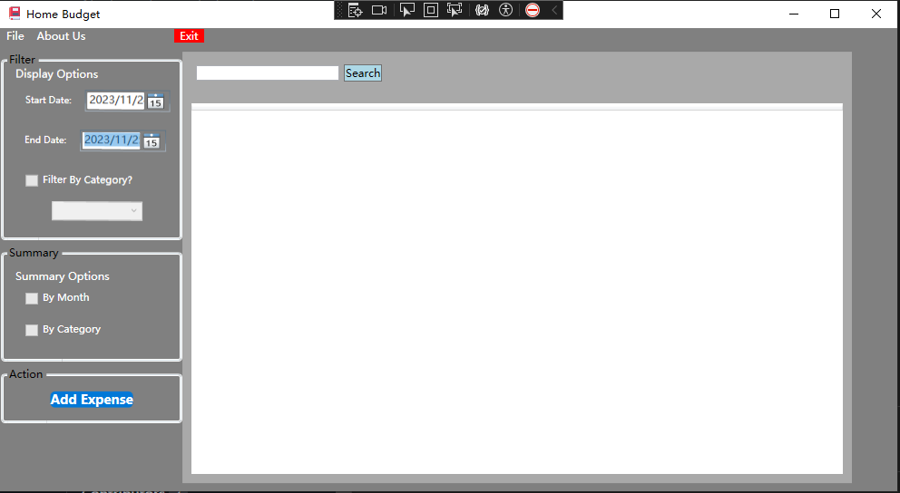
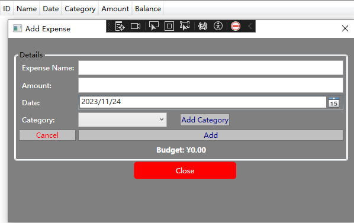

## 🔎 Overview

This app provides a simple and intuitive interface for users to track their spending, analyze patterns, and make informed financial decisions.

## 🔬 Features 

- **Expense Tracking:** Log your daily expenses with details such as category, amount, and date.
- **Budget Visualization:** Visualize your spending patterns through interactive charts and graphs.
- **Category Management:** Customize spending categories to match your lifestyle and financial goals.
- **Expense History:** View a detailed history of your expenses, providing insights into your financial habits.

## 📸 Screenshots

<br/>

## 🔧 Getting Started

To get started with the Home Budget App, follow these steps:

1. **Clone the Repository:**
   ```bash
   git clone https://github.com/JiahaoYu1/HomeBudget-Null.git
   ```
2. **Installation:**
   ```
   cd HomeBudget-Null
   npm install
   ```
3. **Usage:**
   ```
   npm start
   ```
## 🧑‍💻 Contributers
  - Special thanks to Ryan and Caden who have dedicated their time and effort to this project.

## 📑 Link to GitHub Repo page
   - [Home Budget App](https://github.com/JiahaoYu1/HomeBudget-Null)

